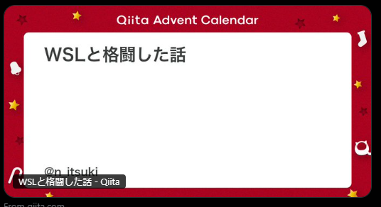

どこかの、アドベントカレンダー18日目の記事です！！！

ただただ、今年を振り返るか～の会です。こういう時は、自分のツイートのメディア欄を見てみるとよさそう

# 1月
スマホが壊れてたり、卒論倒したり、家を探して他っぽいですね

<blockquote class="twitter-tweet">
pixel 7aを買った...!!!💰💰💰 <a href="https://t.co/zBf8qRJcyi">pic.twitter.com/zBf8qRJcyi</a>
&mdash; いつき (@itsuki_jpnlonvn) <a href="https://twitter.com/itsuki_jpnlonvn/status/1746555036723998786?ref_src=twsrc%5Etfw">January 14, 2024</a></blockquote> 

<blockquote class="twitter-tweet">
そういえば，卒論概要を倒しました！！！！！！！！！！！！！！！！！！！🎉🎉🎉🎉🎉🎉🎉🎉🎉🎉🎉🎉🎉🎉🎉🎉🎉🎉🎉🎉 後は本文と発表😭😭😭 <a href="https://t.co/qUdiwoPBZM">pic.twitter.com/qUdiwoPBZM</a>
&mdash; いつき (@itsuki_jpnlonvn) <a href="https://twitter.com/itsuki_jpnlonvn/status/1750877822393217116?ref_src=twsrc%5Etfw">January 26, 2024</a></blockquote> 

<blockquote class="twitter-tweet">
家，初期費用30万近い 悲しい
&mdash; いつき (@itsuki_jpnlonvn) <a href="https://twitter.com/itsuki_jpnlonvn/status/1750833806700081321?ref_src=twsrc%5Etfw">January 26, 2024</a></blockquote> 

# 2月
卒論発表をして、遊び惚ける
<blockquote class="twitter-tweet">
決戦日 いい天気 <a href="https://t.co/TlzhxWm57M">pic.twitter.com/TlzhxWm57M</a>
&mdash; いつき (@itsuki_jpnlonvn) <a href="https://twitter.com/itsuki_jpnlonvn/status/1755757534340891094?ref_src=twsrc%5Etfw">February 9, 2024</a></blockquote> 

これはCLACKの設備を使って、遊んでますね。この時から、3Dモデル面白いじゃん！となった気がします
<blockquote class="twitter-tweet">
ロケット作りました🚀🚀🚀 簡単な形でも難しいものですね... <a href="https://t.co/IIgsBdbfNW">pic.twitter.com/IIgsBdbfNW</a>
&mdash; いつき (@itsuki_jpnlonvn) <a href="https://twitter.com/itsuki_jpnlonvn/status/1756144276936053080?ref_src=twsrc%5Etfw">February 10, 2024</a></blockquote> 

<blockquote class="twitter-tweet">
昨日・一昨日と、淡路島(＋徳島)に行ってました 人生二回目の運転でしたが、何とかなりました ご飯美味しかった <a href="https://t.co/jN2VePTtbW">pic.twitter.com/jN2VePTtbW</a>
&mdash; いつき (@itsuki_jpnlonvn) <a href="https://twitter.com/itsuki_jpnlonvn/status/1757761875138564452?ref_src=twsrc%5Etfw">February 14, 2024</a></blockquote> 

# 3月
どうやら卒業できたらしい。日本の教育機関を卒業するの初めてらしい。なお府大のしょぼい卒業式
<blockquote class="twitter-tweet">
学士(情報学) 認知科学(副専攻) 数理・データサイエンス・AI教育プログラム(応用基礎レベル)  の3枚です!!!🎉🎉🎉🎉🎉🎉🎉 <a href="https://t.co/Xtp9U1YcnR">https://t.co/Xtp9U1YcnR</a> <a href="https://t.co/z9NUm3ziQQ">pic.twitter.com/z9NUm3ziQQ</a>
&mdash; いつき (@itsuki_jpnlonvn) <a href="https://twitter.com/itsuki_jpnlonvn/status/1771039770174751150?ref_src=twsrc%5Etfw">March 22, 2024</a></blockquote> 

<blockquote class="twitter-tweet">
認定されました なにかメリットがある訳ではなさそうですが、嬉しいね <a href="https://t.co/tFjxTUzIII">pic.twitter.com/tFjxTUzIII</a>
&mdash; いつき (@itsuki_jpnlonvn) <a href="https://twitter.com/itsuki_jpnlonvn/status/1770924102980706493?ref_src=twsrc%5Etfw">March 21, 2024</a></blockquote> 

<blockquote class="twitter-tweet">
古墳 <a href="https://t.co/KMqwqFE54D">pic.twitter.com/KMqwqFE54D</a>
&mdash; いつき (@itsuki_jpnlonvn) <a href="https://twitter.com/itsuki_jpnlonvn/status/1770949848952672576?ref_src=twsrc%5Etfw">March 21, 2024</a></blockquote> 

# 4月
一気に写真が増えた気がする。自炊頑張る。山上ったり、イベント行ったり
<blockquote class="twitter-tweet">
お刺身とハンバーグ！！！ 捌いた！🐟🐟🐟🐟🐟🐟 お酒は酒屋さんのおじさんに，面白いのありますか～と聞いたやつ 甘酒みたい <a href="https://t.co/xbLJtdnH9L">pic.twitter.com/xbLJtdnH9L</a>
&mdash; いつき (@itsuki_jpnlonvn) <a href="https://twitter.com/itsuki_jpnlonvn/status/1776549943236587609?ref_src=twsrc%5Etfw">April 6, 2024</a></blockquote> 

<blockquote class="twitter-tweet">
会社の登山部の方々と、高尾山に登った⛰️⛰️⛰️⛰️⛰️⛰️ ちらほらと桜が咲いていてキレイでした <a href="https://t.co/g9BMl5safS">pic.twitter.com/g9BMl5safS</a>
&mdash; いつき (@itsuki_jpnlonvn) <a href="https://twitter.com/itsuki_jpnlonvn/status/1779382735687319819?ref_src=twsrc%5Etfw">April 14, 2024</a></blockquote> 

<blockquote class="twitter-tweet">
ぼっち・ざ・ろっく！展に行きました たのしかった、可愛かった <a href="https://t.co/ndfbObdQ0L">pic.twitter.com/ndfbObdQ0L</a>
&mdash; いつき (@itsuki_jpnlonvn) <a href="https://twitter.com/itsuki_jpnlonvn/status/1784449380327858593?ref_src=twsrc%5Etfw">April 28, 2024</a></blockquote> 

# 5月
勉強してそう（）。適当にぶらぶらしてた
<blockquote class="twitter-tweet">
英語はぐーいーが多そう？ <a href="https://t.co/Cdk0HF5HS0">pic.twitter.com/Cdk0HF5HS0</a>
&mdash; いつき (@itsuki_jpnlonvn) <a href="https://twitter.com/itsuki_jpnlonvn/status/1786397269484564879?ref_src=twsrc%5Etfw">May 3, 2024</a></blockquote> 

<blockquote class="twitter-tweet">
公園 小さい子が「だんだん鯉のぼりが元気になってきた」と鯉のぼりがなびいている様を表現していた 良い言い方で羨ましい <a href="https://t.co/TdaW0RcVjd">pic.twitter.com/TdaW0RcVjd</a>
&mdash; いつき (@itsuki_jpnlonvn) <a href="https://twitter.com/itsuki_jpnlonvn/status/1786605560642814402?ref_src=twsrc%5Etfw">May 4, 2024</a></blockquote> 

<blockquote class="twitter-tweet">
東京タワーに来た🗼🗼🗼 高かった 登っては無い <a href="https://t.co/LO29mNvchZ">pic.twitter.com/LO29mNvchZ</a>
&mdash; いつき (@itsuki_jpnlonvn) <a href="https://twitter.com/itsuki_jpnlonvn/status/1791412353634058479?ref_src=twsrc%5Etfw">May 17, 2024</a></blockquote> 

# 6月
ご飯をよく食べてた

# 7月
猫カフェいったり、千日紅もらったり、咲いたり
<blockquote class="twitter-tweet">
<a href="https://t.co/pgIpafnxWb">pic.twitter.com/pgIpafnxWb</a>
&mdash; いつき (@itsuki_jpnlonvn) <a href="https://twitter.com/itsuki_jpnlonvn/status/1807757401195495738?ref_src=twsrc%5Etfw">July 1, 2024</a></blockquote> 

<blockquote class="twitter-tweet">
<a href="https://t.co/ixpTlwXkY9">pic.twitter.com/ixpTlwXkY9</a>
&mdash; いつき (@itsuki_jpnlonvn) <a href="https://twitter.com/itsuki_jpnlonvn/status/1812745068589326358?ref_src=twsrc%5Etfw">July 15, 2024</a></blockquote> 

<blockquote class="twitter-tweet">
咲いてた!!! <a href="https://t.co/2QybI66Fl5">pic.twitter.com/2QybI66Fl5</a>
&mdash; いつき (@itsuki_jpnlonvn) <a href="https://twitter.com/itsuki_jpnlonvn/status/1817355242323014022?ref_src=twsrc%5Etfw">July 28, 2024</a></blockquote> 

# 8月
未来館堪能したり、smart band 割れたり、
<blockquote class="twitter-tweet">
今日は未来館に行きました 「AIスーツケースで常設展を歩こう」、を体験しました RGB-Dセンサ、LiDARを使っているそう (ミニPCで全ての演算を行っているか、聞けばよかったな...) Co-studioの「人のように言葉を学ぶロボットのつくりかた」も聞いた llmや、認知発達ロボティクスを学んだ <a href="https://t.co/Hm6K1Ds1gf">pic.twitter.com/Hm6K1Ds1gf</a>
&mdash; いつき (@itsuki_jpnlonvn) <a href="https://twitter.com/itsuki_jpnlonvn/status/1822965776564867320?ref_src=twsrc%5Etfw">August 12, 2024</a></blockquote> 

<blockquote class="twitter-tweet">
xiaomi smart band 7, 落下して壊れた... 非常に悲しい <a href="https://t.co/WqAYlg3Hk4">pic.twitter.com/WqAYlg3Hk4</a>
&mdash; いつき (@itsuki_jpnlonvn) <a href="https://twitter.com/itsuki_jpnlonvn/status/1827919750858682581?ref_src=twsrc%5Etfw">August 26, 2024</a></blockquote> 

# 9月
モニターもらったり、gemini のAPIたたいたり、真理に気づいたり
<blockquote class="twitter-tweet">
いい感じになったのでは!!! あとはノーパソが右のモニターと置き換わり、右のが27と置き換われば完璧💯💮 <a href="https://t.co/gzgyrQgrje">pic.twitter.com/gzgyrQgrje</a>
&mdash; いつき (@itsuki_jpnlonvn) <a href="https://twitter.com/itsuki_jpnlonvn/status/1840378940445315348?ref_src=twsrc%5Etfw">September 29, 2024</a></blockquote> 

<blockquote class="twitter-tweet">
1日たくさん呼べるし、気にせんくていいか <a href="https://t.co/x8vUOSeLOy">pic.twitter.com/x8vUOSeLOy</a>
&mdash; いつき (@itsuki_jpnlonvn) <a href="https://twitter.com/itsuki_jpnlonvn/status/1840218904087646623?ref_src=twsrc%5Etfw">September 29, 2024</a></blockquote> 

<blockquote class="twitter-tweet">
そこそこの人数がいたが&quot;jumpstart&quot;でTwitter検索かけても直近の日本語のあまりないな 人類Twitterをしていない...?
&mdash; いつき (@itsuki_jpnlonvn) <a href="https://twitter.com/itsuki_jpnlonvn/status/1839622696629674084?ref_src=twsrc%5Etfw">September 27, 2024</a></blockquote> 

# 10月
旅行行ったり、3Dプリンタが来たり、本を読んだり
<blockquote class="twitter-tweet">
三連休は大学の時の子と、関東観光しました オリエンタル博物館、歴史よわよわですが面白かった 中華街は人多すぎて食べ歩き出来んかった <a href="https://t.co/7KiThTiQQ9">pic.twitter.com/7KiThTiQQ9</a>
&mdash; いつき (@itsuki_jpnlonvn) <a href="https://twitter.com/itsuki_jpnlonvn/status/1846136676420407465?ref_src=twsrc%5Etfw">October 15, 2024</a></blockquote> 

<blockquote class="twitter-tweet">
3Dプリンタ君がビート刻んでる <a href="https://t.co/5JMnrurdcd">pic.twitter.com/5JMnrurdcd</a>
&mdash; いつき (@itsuki_jpnlonvn) <a href="https://twitter.com/itsuki_jpnlonvn/status/1850002907552444725?ref_src=twsrc%5Etfw">October 26, 2024</a></blockquote> 

<blockquote class="twitter-tweet">
続き読みました 面白かった 私みたいな推理しない、雰囲気で楽しんでる人に対しての批判?が出てきてびっくりしてた。頑張って考えたけど分からなかった <a href="https://t.co/yjFk00Ta6b">https://t.co/yjFk00Ta6b</a> <a href="https://t.co/MQaPC6sMUy">pic.twitter.com/MQaPC6sMUy</a>
&mdash; いつき (@itsuki_jpnlonvn) <a href="https://twitter.com/itsuki_jpnlonvn/status/1841108248528920949?ref_src=twsrc%5Etfw">October 1, 2024</a></blockquote> 

# 11月
文化堪能ツアーしたり、公園行ったり、モンハンの体験版やったり、3Dプリンタしたり
<blockquote class="twitter-tweet">
文化の日だったので、上野で文化巡りしてきた 特別展は人が多く、行く気にならなかった... <a href="https://t.co/Um2sabZzoo">pic.twitter.com/Um2sabZzoo</a>
&mdash; いつき (@itsuki_jpnlonvn) <a href="https://twitter.com/itsuki_jpnlonvn/status/1853000075649470950?ref_src=twsrc%5Etfw">November 3, 2024</a></blockquote> 

<blockquote class="twitter-tweet">
いしがみぃ公園と東映アニメーションミュージアムに行きました! 秋を感じた わかるマーンとポットがあった <a href="https://t.co/JLu4wVt45h">pic.twitter.com/JLu4wVt45h</a>
&mdash; いつき (@itsuki_jpnlonvn) <a href="https://twitter.com/itsuki_jpnlonvn/status/1858014357051027781?ref_src=twsrc%5Etfw">November 17, 2024</a></blockquote> 

<blockquote class="twitter-tweet">
初めてのモンハン！ 画面がきれいですごい <a href="https://t.co/ySlYAtzVvm">pic.twitter.com/ySlYAtzVvm</a>
&mdash; いつき (@itsuki_jpnlonvn) <a href="https://twitter.com/itsuki_jpnlonvn/status/1852297458971500737?ref_src=twsrc%5Etfw">November 1, 2024</a></blockquote> 

<blockquote class="twitter-tweet">
ケーブルが短く、自分のを使うと上手く自立しないので、3Dプリンターでスタンドを作りました!!! <a href="https://t.co/oOuoQgzQc8">https://t.co/oOuoQgzQc8</a> <a href="https://t.co/DmhbuSfM7O">pic.twitter.com/DmhbuSfM7O</a>
&mdash; いつき (@itsuki_jpnlonvn) <a href="https://twitter.com/itsuki_jpnlonvn/status/1862453591245824419?ref_src=twsrc%5Etfw">November 29, 2024</a></blockquote> 
